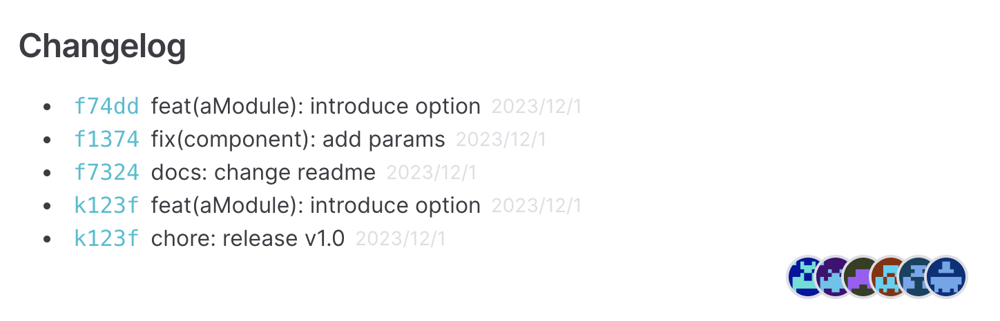
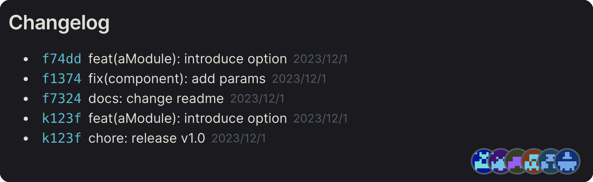

# vitepress-plugin-changelog
Used to display the change history and personnel of the *.md document.

## UI Example
### theme


### dark theme



## Installation
```shell
pnpm install vitepress-plugin-changelog md5 -D
```

## Usage
> Since I really didn't understand how vitepress should share this plugin, the steps were quite complicated.

> 👏 Looking forward to your improvement and optimization.

### Import style
`.vitepress/theme/index.js`
```js
// # .vitepress/theme/index.js

import DefaultTheme from 'vitepress/theme'

// import style css
import 'vitepress-plugin-changelog/changelog.css'

.....
```

### add PageLayout

#### `PageLayout`
```vue
<script setup>
import DefaultTheme from 'vitepress/theme'
import Changelog from 'vitepress-plugin-changelog/Changelog.vue'

const { Layout } = DefaultTheme


</script>

<template>
  <Layout>
    <template #doc-footer-before>
      <Changelog/>
    </template>
  </Layout>
</template>
```

#### `.vitepress/theme/index.js`
```js
// # .vitepress/theme/index.js
import DefaultTheme from 'vitepress/theme'
import 'vitepress-plugin-changelog/changelog.css'
import PageLayout from '../layout/PageLayout.vue'

export default {
  extends: DefaultTheme,
  Layout: PageLayout
}

```


### Add TranData
`.vitepress/config.js`
```js
// # .vitepress/config.js

import { defineConfig } from 'vitepress'

// import fn
import { getChangelogAndContributors } from 'vitepress-plugin-changelog'

export default defineConfig({
 
  async transformPageData ({ relativePath }) {
    const { contributors, changelog } = await getChangelogAndContributors(relativePath)
    return {
      CommitData: {
        contributors,
        changelog,
        commitURL: 'https://github/commit/',
        title: 'Changelog'
      }
    }
  }
})

```

### Support

####  Custom Avatar

Default acquisition of gravatar avatar `https://gravatar.com/avatar/${hash}?d=retro`

> Taking gogs as an example, adapting different contributor avatars.

`.vitepress/config.js`
```js
// # .vitepress/config.js

async transformPageData ({ relativePath }) {
    const { contributors, changelog } = await getChangelogAndContributors(relativePath)
    const CustomAvatars = {
        'aaa': '26',
        'bbb': '36'
    }
    const CustomContributors = contributors.map(contributor => {
        contributor.avatar = `https://xxx.gogs.xxx/avatars/${CustomAvatars[contributor.name]}`
        return contributor
    })
    return {
        CommitData: {
            contributors: CustomContributors,
            changelog,
            commitURL: 'https://xxx.gogs.xxx/organization/repo/commit/',
            title: 'Changelog'
        }
    }
}

```

#### Custom more
> You can completely customize your Changelog.vue components.

## Thanks

* [@vueuse](https://github.com/vueuse/vueuse)
